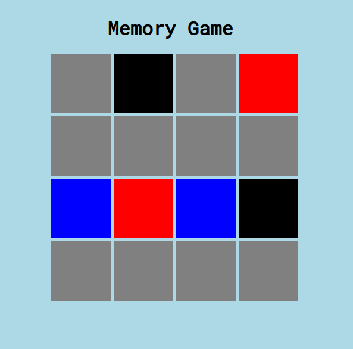

# Memory Game

This is a randomized and color coded web browswer game built using Vanilla Javascript.

It currently has one level of difficulty and does not keep scores when playing but such features and more will be integrated into to game.

### Find live project here: https://xolanimgube.github.io/memory-game/

## How to Run the application
This is a simple HTML, CSS and JS website so it is also simple to run it. Just open the index.html file with a browser.

### Contribution and File Structure
- Clone Repo

- From the root folder, index.html is HTML file with the structureing of website and is linked to the css and js

- css folder >> style.css is where you will find the css used in the webpage. The structure is built in CSS grid.

- js folder >> main.js is where all the functionality of the website is.

## Project Demo

An Image of how the interface looks

<p></p>

## Technologies used

- ```HTML 5```
- ``` CSS 3 and CSS Grid```
- ```Javascript ES5 and ES6```

